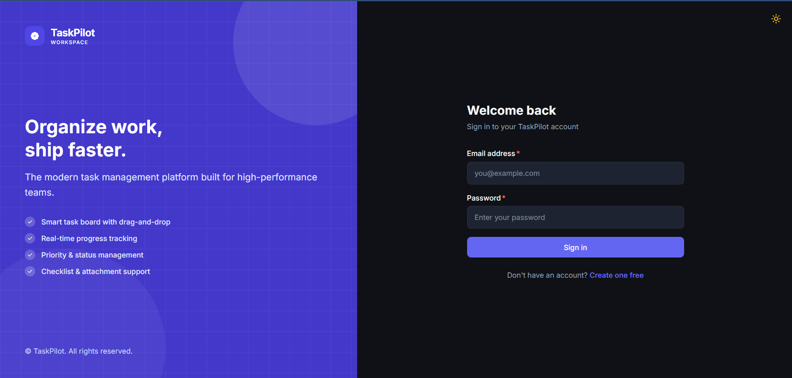
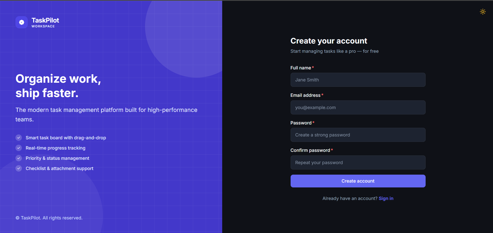
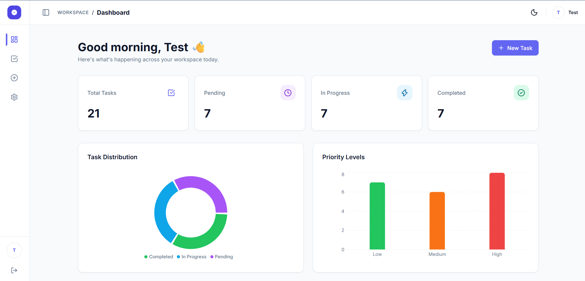
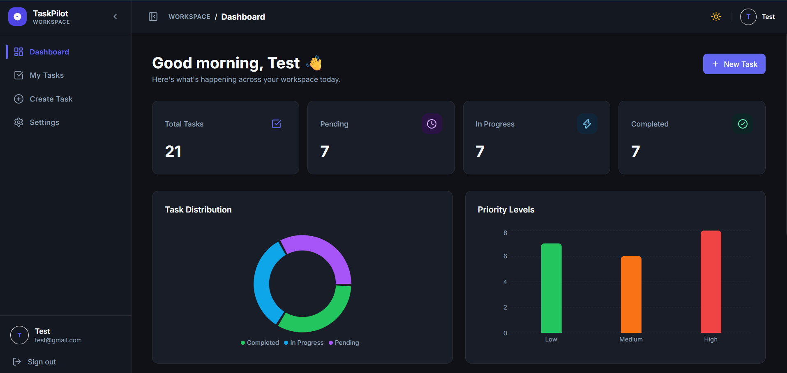
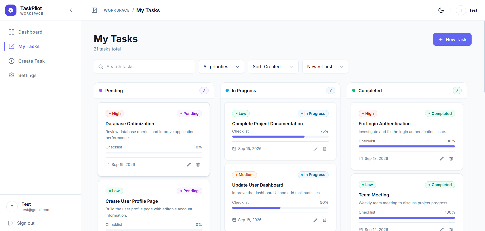
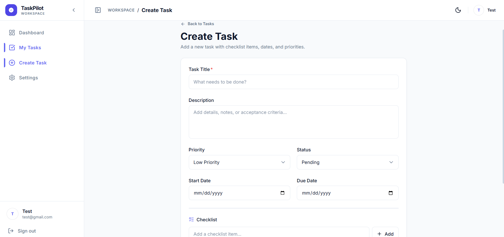
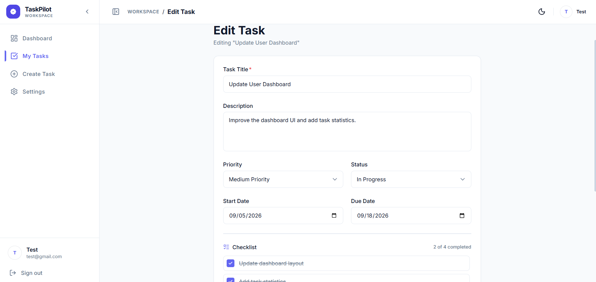
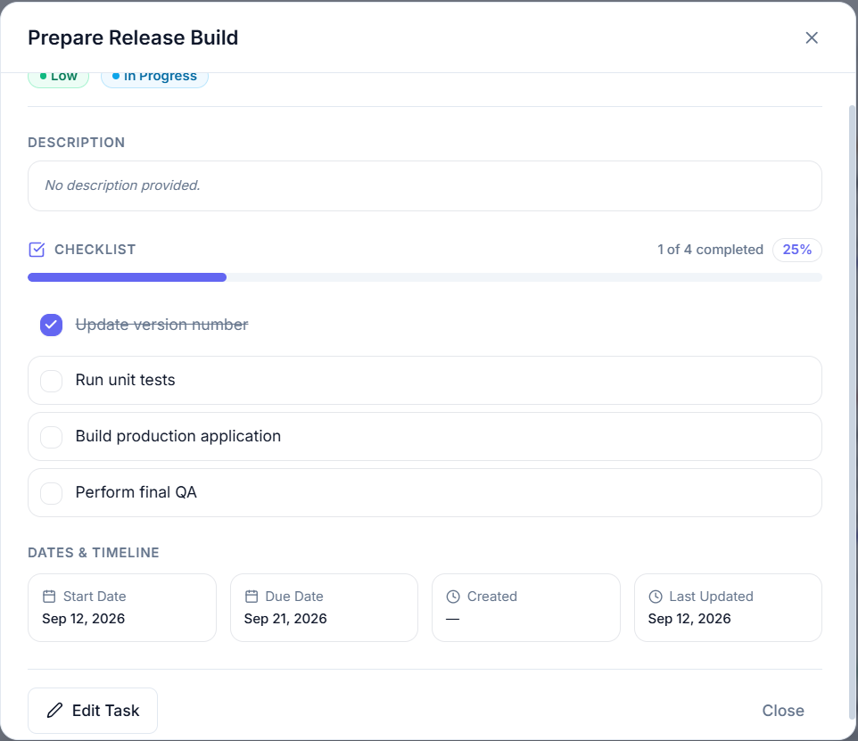
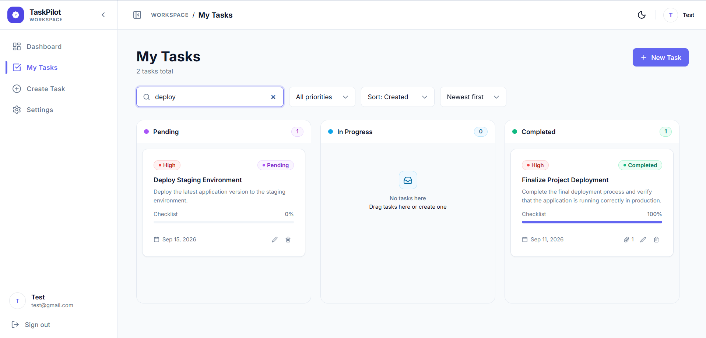
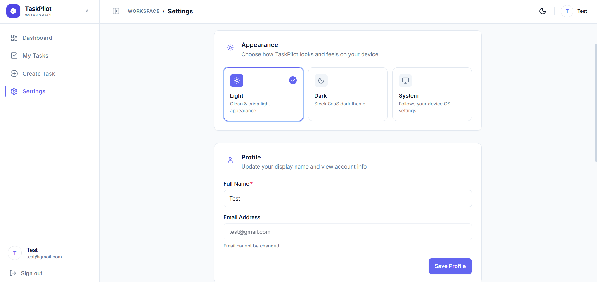

# 🚀 TaskPilot

<div align="center">


### Modern, High-Performance Task & Project Management

A full-stack MERN application engineered for high-velocity teams and individuals to organize, track, and ship work effortlessly.

[](https://react.dev/)
[](https://nodejs.org/)
[](https://expressjs.com/)
[](https://www.mongodb.com/)
[](https://tailwindcss.com/)
[](https://vitejs.dev/)
[](LICENSE)

</div>

---

## 🌐 Live Demo

- **Application URL:** [https://taskpilot-sandy-kappa.vercel.app](https://taskpilot-sandy-kappa.vercel.app)
- **API Health Check:** [https://taskpilot-yfmu.onrender.com/api/health](https://taskpilot-yfmu.onrender.com/api/health)

## 📦 Repository

- **GitHub Repository:** [https://github.com/tejasvairal1234/TaskPilot](https://github.com/tejasvairal1234/TaskPilot)

---

## 📸 Project Screenshots

### Login


### Register


### Dashboard - Light Mode


### Dashboard - Dark Mode


### Task Management


### Create Task


### Edit Task


### Task Details


### Search / Filter


### Settings


---

## ✨ Key Features

### 📋 Interactive Kanban Workflow
- **Drag-and-Drop Board:** Fluid, accessible drag-and-drop powered by `@hello-pangea/dnd` across **Pending**, **In Progress**, and **Completed** columns.
- **Optimistic State Updates:** Instant UI transitions with automatic rollback on network failure.
- **Visual Status Badges:** Semantic status indicators with color-coded dot icons and column counts.

### 📊 Real-Time Analytics Dashboard
- **Aggregate Metrics:** Live counters for Total Tasks, Pending, In Progress, and Completed.
- **Interactive Visualizations:**
  - **Task Distribution:** Recharts donut chart with interactive tooltips.
  - **Priority Levels:** Horizontal bar chart illustrating workload distribution by priority.
- **Recent Tasks Feed:** Quick-access list showing recent activity with direct edit shortcuts.

### 🔍 Advanced Search, Filtering & Sorting
- **Debounced Search:** Real-time search by title with a 400ms debounce to minimize API load and avoid query spikes.
- **Multi-Factor Filtering:** Filter board view by priority (`low`, `medium`, `high`) or status.
- **Flexible Ordering:** Sort tasks by Created Date, Due Date, Priority, or Title in ascending/descending order.

### 📝 Comprehensive Task Management
- **Detailed Metadata:** Title, rich description, start date, and due date.
- **Overdue Detection:** Automated overdue badge calculation with relative time indications.
- **Subtask Checklists:** Interactive multi-item checklists with automatic completion percentage tracking.
- **External Attachments:** Add external URLs (Figma, GitHub PRs, documentation) with dedicated icons.
- **Confirmation Modals:** Accessible dialogs preventing accidental deletions.

### 🎨 Premium Design System & Theme Engine
- **Light & Dark Mode:** Curated HSL color palettes with zero-flash persistence via `localStorage`.
- **Subtle Dark Mode Borders:** Tailored `--border: rgba(255, 255, 255, 0.07)` styling avoiding harsh lines.
- **Collapsible Navigation:**
  - **Desktop Sidebar:** Smooth transitions between expanded (256px) and icon-only collapsed (80px) states with hover tooltips.
  - **Mobile Drawer:** Touch-optimized off-canvas navigation with backdrop blur.

### 🔒 Enterprise-Grade Security
- **Dual-Token Authentication:** Short-lived JWT access tokens (15m) paired with rotating refresh tokens (7d) stored in secure `httpOnly`, `sameSite` cookies.
- **Strict Authorization:** All database operations strictly scoped to the authenticated user ID (`req.user._id`).
- **Input Validation:** Unified Zod schema validation on backend routes with client-side error messaging.
- **Attack Mitigation:**
  - **Rate Limiting:** IP-based rate limiting on authentication routes (20 requests per 15 minutes).
  - **NoSQL Injection Defense:** Sanitization of query operators via custom middleware.
  - **ReDoS Prevention:** Regex character escaping on full-text search parameters.
  - **Security Headers:** HTTP protection configured through Helmet.

---

## 🛠️ Tech Stack

### Frontend
| Package | Version | Purpose |
|---|---|---|
| **React** | 19.2 | Core user interface library |
| **Vite** | 8.2 | Next-generation build tool and dev server |
| **Tailwind CSS** | 3.4 | Utility-first CSS framework |
| **React Router** | 7.18 | Client-side routing with protected route guards |
| **@hello-pangea/dnd** | 18.0 | Accessible, fluid drag-and-drop for Kanban boards |
| **Recharts** | 3.10 | Responsive SVG charting library |
| **Axios** | 1.20 | HTTP client with request/response interceptors & token refresh |
| **Lucide React** | 1.41 | Clean, modern iconography |
| **React Hot Toast** | 2.6 | Lightweight toast notification system |

### Backend
| Package | Version | Purpose |
|---|---|---|
| **Node.js** | 18+ | JavaScript runtime environment |
| **Express.js** | 5.2 | Web application framework for RESTful APIs |
| **MongoDB & Mongoose** | 9.9 | NoSQL database with strict schema modeling and indexing |
| **JSON Web Token** | 9.0 | Stateless access & refresh token authentication |
| **bcrypt** | 6.0 | Salted password hashing (12 rounds) |
| **Zod** | 4.5 | Schema declaration and request validation |
| **Helmet** | 8.0 | HTTP security headers |
| **express-rate-limit** | 7.5 | Rate limiting against brute-force attacks |
| **cookie-parser** | 1.4 | Secure cookie handling for refresh tokens |
| **cors** | 2.8 | Whitelisted Cross-Origin Resource Sharing |

---

## 📁 Project Structure

```
TaskPilot/
├── backend/
│   ├── scripts/
│   │   ├── seedDemoTasks.js          # Idempotent demo task seeder (20 realistic tasks)
│   │   └── testValidation.js         # Automated end-to-end API test suite
│   ├── src/
│   │   ├── controllers/
│   │   │   ├── auth/
│   │   │   │   └── userController.js # Register, login, refresh, logout, profile
│   │   │   └── task/
│   │   │       └── taskController.js # CRUD, dashboard aggregation, search, filter
│   │   ├── db/
│   │   │   └── connect.js            # MongoDB Mongoose connection handler
│   │   ├── helpers/
│   │   │   └── generateToken.js      # JWT token signers (access & refresh)
│   │   ├── middlewares/
│   │   │   ├── errorMiddleware.js    # Centralized error handler & 404 handler
│   │   │   ├── mongoSanitizeMiddleware.js # NoSQL sanitization
│   │   │   ├── protectMiddleware.js  # JWT Bearer verification guard
│   │   │   └── validateMiddleware.js # Zod request validation wrapper
│   │   ├── models/
│   │   │   ├── auth/
│   │   │   │   ├── RefreshTokenModel.js # Token rotation store with TTL
│   │   │   │   └── UserModel.js         # User schema with bcrypt hooks
│   │   │   └── tasks/
│   │   │       └── TaskModel.js         # Task schema with indexes & checklist subdocs
│   │   ├── routes/
│   │   │   ├── taskRoute.js          # /api/tasks router
│   │   │   └── userRoute.js          # /api/auth router
│   │   └── validators/
│   │       ├── authValidator.js      # Zod validation schemas for auth
│   │       └── taskValidator.js      # Zod validation schemas for tasks
│   ├── .env.example
│   ├── package.json
│   └── server.js                     # Express application entrypoint
│
├── client/
│   ├── public/
│   │   ├── favicon.svg               # Authentic TaskPilot scalloped seal logo
│   │   └── icons.svg
│   ├── src/
│   │   ├── api/
│   │   │   └── axiosInstance.js      # Axios instance with 401 refresh interceptors
│   │   ├── components/
│   │   │   ├── layout/
│   │   │   │   ├── AppLayout.jsx     # Master application shell
│   │   │   │   ├── AuthLayout.jsx    # Split-screen authentication layout
│   │   │   │   ├── Header.jsx        # Top navigation with theme toggle & user badge
│   │   │   │   ├── MobileSidebar.jsx # Off-canvas drawer for mobile
│   │   │   │   └── Sidebar.jsx       # Collapsible desktop sidebar
│   │   │   ├── navigation/
│   │   │   │   └── NavItem.jsx       # Accessible sidebar link with active indicators
│   │   │   ├── tasks/
│   │   │   │   ├── TaskCard.jsx      # Draggable card with badges & checklist progress
│   │   │   │   ├── TaskColumn.jsx    # Kanban column drop zone
│   │   │   │   └── TaskForm.jsx      # Task create/edit form with dynamic checklists
│   │   │   └── ui/
│   │   │       ├── Button.jsx        # Styled button variants
│   │   │       ├── ConfirmDialog.jsx # Accessible confirmation modal
│   │   │       ├── EmptyState.jsx    # Zero-state illustration and CTA
│   │   │       ├── Input.jsx         # Form input with validation states
│   │   │       ├── LoadingScreen.jsx # Full-page branded loader
│   │   │       ├── Modal.jsx         # Trapped-focus modal dialog
│   │   │       ├── PriorityBadge.jsx # Low/Medium/High semantic badge
│   │   │       ├── Select.jsx        # Custom dropdown selector
│   │   │       ├── Skeleton.jsx      # Pulse placeholder loaders
│   │   │       ├── Spinner.jsx       # Animated loading spinner
│   │   │       ├── StatusBadge.jsx   # Pending/In-Progress/Completed badge
│   │   │       ├── TaskPilotLogo.jsx # Original TaskPilot logo component
│   │   │       ├── ThemeToggle.jsx   # Light/Dark theme toggle button
│   │   │       └── Tooltip.jsx       # Floating context tooltip
│   │   ├── context/
│   │   │   ├── AuthContext.jsx       # User authentication state provider
│   │   │   └── ThemeContext.jsx      # Light/Dark theme state provider
│   │   ├── hooks/
│   │   │   └── useDebounce.js        # Value debouncing hook
│   │   ├── pages/
│   │   │   ├── CreateTaskPage.jsx    # Task creation page
│   │   │   ├── DashboardPage.jsx     # Metrics, Recharts visualizations & recent tasks
│   │   │   ├── EditTaskPage.jsx      # Task modification page
│   │   │   ├── LoginPage.jsx         # User login page
│   │   │   ├── NotFoundPage.jsx      # 404 Error page
│   │   │   ├── RegisterPage.jsx      # Account registration page
│   │   │   ├── SettingsPage.jsx      # Profile, theme, & danger zone settings
│   │   │   └── TasksPage.jsx         # Full Kanban board with search & filters
│   │   ├── routes/
│   │   │   ├── AppRoutes.jsx         # Route registry
│   │   │   └── ProtectedRoute.jsx    # Authentication route guard
│   │   ├── services/
│   │   │   ├── authService.js        # Auth API calls
│   │   │   └── taskService.js        # Task API calls
│   │   ├── utils/
│   │   │   ├── constants.js          # App constants, statuses, priority colors
│   │   │   └── helpers.js            # Date formatting, initials, error parsers
│   │   ├── App.jsx
│   │   ├── index.css                 # Design tokens, CSS variables, dark borders
│   │   └── main.jsx
│   ├── .env.example
│   ├── index.html
│   ├── package.json
│   ├── tailwind.config.js
│   └── vite.config.js
│
├── screenshots/                      # Application screenshot assets
│   └── .gitkeep
├── .gitignore
└── README.md
```

---

## 📡 REST API Reference

All requests accept and return `application/json`. Authenticated routes require an `Authorization: Bearer <token>` header.

### 🔐 Authentication Endpoints (`/api/auth`)

| Method | Endpoint | Auth Required | Description |
|---|---|:---:|---|
| `POST` | `/register` | No | Register a new user account |
| `POST` | `/login` | No | Authenticate user, receive access token & set refresh cookie |
| `POST` | `/refresh` | No | Exchange refresh token cookie for a new access token |
| `POST` | `/logout` | No | Invalidate refresh token and clear cookie |
| `GET` | `/me` | **Yes** | Retrieve authenticated user profile |
| `PUT` | `/me` | **Yes** | Update user profile (name, bio, photo) or change password |
| `DELETE` | `/me` | **Yes** | Permanently delete account and cascade delete tasks |

### 📋 Task Endpoints (`/api/tasks`)

| Method | Endpoint | Auth Required | Description |
|---|---|:---:|---|
| `GET` | `/dashboard` | **Yes** | Aggregate statistics (status, priority) & 5 recent tasks |
| `GET` | `/` | **Yes** | List user tasks with pagination, search, filter, and sort |
| `POST` | `/` | **Yes** | Create a new task |
| `GET` | `/:id` | **Yes** | Get task details by ID |
| `PUT` | `/:id` | **Yes** | Update task (status, priority, checklist, etc.) |
| `DELETE` | `/:id` | **Yes** | Permanently delete a task |

#### Query Parameters for `GET /api/tasks`

| Parameter | Type | Default | Description |
|---|---|---|---|
| `search` | `string` | — | Case-insensitive title search (ReDoS-safe) |
| `status` | `string` | — | Filter by `pending`, `in-progress`, or `completed` |
| `priority` | `string` | — | Filter by `low`, `medium`, or `high` |
| `sort` | `string` | `createdAt` | Sort field: `createdAt`, `dueDate`, `priority`, `title` |
| `order` | `string` | `desc` | Sort direction: `asc` or `desc` |
| `page` | `number` | `1` | Pagination page number |
| `limit` | `number` | `20` | Results per page (max `100`) |

---

## 🔑 Environment Variables

### Backend Configuration (`backend/.env`)

| Variable | Required | Default | Description |
|---|:---:|---|---|
| `PORT` | No | `5000` | Port for Express server |
| `MONGODB_URL` | **Yes** | `mongodb://localhost:27017/taskpilot` | MongoDB connection URI (local or Atlas) |
| `ACCESS_TOKEN_SECRET` | **Yes** | — | Cryptographic secret for signing access JWTs (15m) |
| `REFRESH_TOKEN_SECRET` | **Yes** | — | Cryptographic secret for signing refresh JWTs (7d) |
| `CLIENT_URL` | **Yes** | `http://localhost:5173` | Allowed CORS frontend origin |
| `NODE_ENV` | No | `development` | Environment mode (`development` / `production`) |

> **Generate cryptographic secrets:**
> ```bash
> node -e "console.log(require('crypto').randomBytes(64).toString('base64'))"
> ```

### Frontend Configuration (`client/.env`)

| Variable | Required | Default | Description |
|---|:---:|---|---|
| `VITE_API_URL` | **Yes** | `http://localhost:5000/api` | Backend API root URL (no trailing slash) |

---

## 🚀 Getting Started

### Prerequisites
- **Node.js:** v18.0.0 or higher
- **npm:** v9.0.0 or higher
- **MongoDB:** Locally installed instance or a [MongoDB Atlas](https://www.mongodb.com/atlas) cluster

---

### 1. Clone the Repository
```bash
git clone YOUR_GITHUB_REPOSITORY_URL
cd TaskPilot
```

---

### 2. Backend Setup
```bash
cd backend

# Install dependencies
npm install

# Configure environment variables
cp .env.example .env
# Edit .env and supply your MONGODB_URL and JWT secrets

# Start development server with hot-reload
npm run dev
```
The backend will start at `http://localhost:5000`.

---

### 3. Frontend Setup
In a new terminal window:
```bash
cd client

# Install dependencies
npm install

# Configure environment variables
cp .env.example .env

# Start Vite development server
npm run dev
```
The frontend will start at `http://localhost:5173`.

---

### 4. Populate Demo Data (Optional)

TaskPilot includes a built-in idempotent seeding script to populate your workspace with **20 realistic project management tasks** across various statuses, priorities, due dates, checklists, and attachments:

```bash
cd backend
npm run seed:demo
```

#### Demo User Credentials:
- **Email:** `test@gmail.com`
- **Password:** `Test@123`

#### Seeded Distribution:
- **Total Tasks:** 20
- **Statuses:** 7 Pending · 6 In Progress · 7 Completed
- **Priorities:** 7 High · 8 Medium · 5 Low

*Note: Running `npm run seed:demo` multiple times is safe and will not create duplicate entries.*

---

## 🧪 Testing & Validation

### Automated End-to-End API Test Suite
Run the validation script to test authentication, dashboard metrics, search, filtering, drag-and-drop status changes, task edits, and deletion:
```bash
cd backend
node scripts/testValidation.js
```

### Production Build Verification
To verify that the frontend builds cleanly for production:
```bash
cd client
npm run build
```

---

## 🚢 Production Deployment

### Backend (Render / Railway / Fly.io)
1. Link your repository and set the root directory to `backend`.
2. Set build command: `npm install`
3. Set start command: `npm start`
4. Add environment variables in your hosting provider's dashboard:
   - `NODE_ENV=production`
   - `PORT=5000` (or leave default assigned by host)
   - `MONGODB_URL=mongodb+srv://<user>:<password>@cluster.mongodb.net/taskpilot`
   - `ACCESS_TOKEN_SECRET=<64-byte-random-string>`
   - `REFRESH_TOKEN_SECRET=<64-byte-random-string>`
   - `CLIENT_URL=https://your-taskpilot-frontend.vercel.app`

### Frontend (Vercel / Netlify)
1. Link your repository and set the root directory to `client`.
2. Build command: `npm run build`
3. Output directory: `dist`
4. Add environment variable:
   - `VITE_API_URL=https://your-taskpilot-backend.onrender.com/api`

---

## 📄 License

This project is open source and available under the [ISC License](LICENSE).
